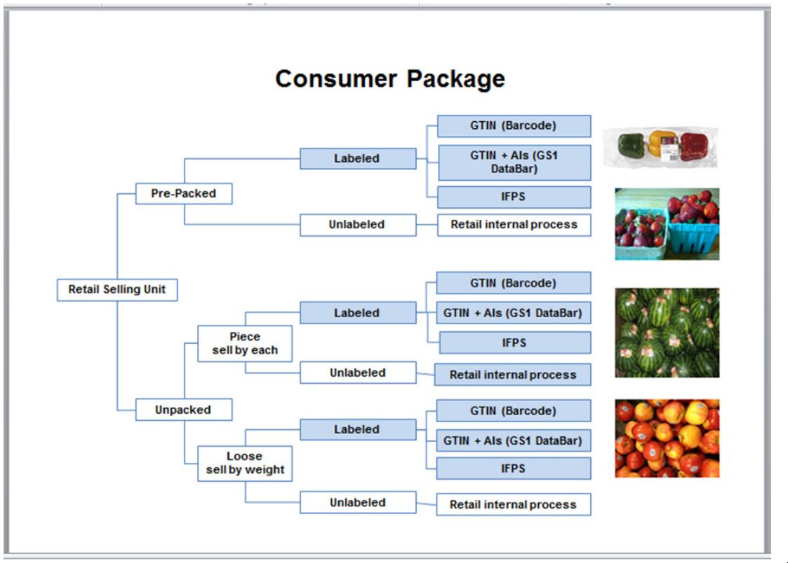

# このドキュメントは何？

生鮮食品向けに扱われているバーコードの仕様を整理しているドキュメントです。

-----

# GTIN

いわゆるバーコードに記載されている数字の羅列の仕様はGTINという呼称が現在の世界標準  
限られた桁数の中で業種毎にルールを決めて採番している。

### 歴史的経緯

```
1970年前半 U.P.C (US,CAで12桁)
↓
1970年後半 EAN(UE 13桁) ※U.P.Cに国の1桁追加したもの
↓
日本が加盟し、EANをJANと呼称
↓
国際EAN協会がGS1, U.P.C, EAN, JANと別れていた呼称をGTINに統一
GTIN-12(U.P.C相当)、GTIN-13(EAN,JAN相当)
```

参考:

* [歴史的経緯](https://www.logizard-zero.com/columns/jancode3.html)
* [GTINの種別](https://aimjal.co.jp/gijutu/barcode/gtin.html)

### GS1

GS1とはサプライチェーンにおける効率化と可視化などのため、流通システムの標準化や流通コードの管理及び流通標準に関する国際機関

GS1では国際標準の①識別コード(Identify)、②データキャリア(Capture)、③情報の共有手段(Share)を定めている。

参考:

* [GS1の青果物](https://www.gs1.org/standards/fresh-fruit-and-vegetable-traceability-guideline/current-standard#1-Introduction+1-4-About-GS1)
* [GS1日本による説明](https://www.gs1jp.org/standard/gs1/index.html)

### GJDB(GS1 Japan Data Bank)

事業者がGTINコードを取得し公開するためにGS1が用意している仕組み

参考: [GJDB説明](https://www.logizard-zero.com/columns/jancode3.html)

### EDI

EDIはElectronic Data Interchange（電子データ交換）の略  
他業種だと金融業界で使われるFIX protocol等がある。

### GS1による青果物のGTIN番号付与ガイドライン

梱包のシチュエーションによってどのコード体系を採用するべきかの図

[GS1 Fruit & Vegetable GTIN Assignment Implementation Guidlineより](https://www.gs1.org/docs/freshfood/Fruit_and_Vegetable_GTIN%20Assignment_Guideline.pdf)

GTIN採番の観点として、基本項目と商品別項目の各項目を挙げている。

#### 基本項目

| Basic Characteristics                                           | Explanation                                                                                                                   | Example                                                            |
|-----------------------------------------------------------------|-------------------------------------------------------------------------------------------------------------------------------|--------------------------------------------------------------------|
| Commodity name                                                  | Name of the produce  (Botanic Name/ descendant from)                                                                          | Apple (Malus Domestica)                                            |
| Growing method                                                  | Organic; Transitional; Conventional                                                                                           | Organic                                                            |
| Country of origin/region                                        | Country of origin (optional also region of origin or national, regional or local name of product)                             | Netherlands                                                        |
| Brand Name (incl. No Name)                                      |                                                                                                                               | Organic                                                            |
| Premium Attribute / Commercial Claim (includes Maturity Method) | Premium attributes are used to distinguish from regular products, e.g. air-transport, ready-to-eat, citrus fruit with leaves. | Clementines with leaves (Premium Attribute)Ready-to-Eat (Maturity) |

#### 商品別項目

| Product Specific Characteristics          | Explanation                                                                      | Example                           |
|-------------------------------------------|----------------------------------------------------------------------------------|-----------------------------------|
| Size                                      | Size of the product according to relevant standards                              | Apples 75/85 mm                   |
| Class (Grade)                             | Class (Grade) of the product according to relevant standards                     | Extra, Class I, Class II          |
| Colour                                    | Colour of the fruit/vegetable (not colour of flesh)                              | Gooseberries: white               |
| Shape                                     | Shape of the fruit/vegetable                                                     | Cucumbers: crooked                |
| Variety                                   | Variety of the fruit or vegetable                                                | Apple: Elstar                     |
| Commercial type                           | Commercial type of fruit or vegetable used in trade                              | Citrus: Primofiore                |
| Colour of Flesh                           | Colour of the inner flesh of fruit or vegetable                                  | Peaches: white;                   |
| Post Harvest Treatment                    | Post-harvest treatment: chemical treatment or waxed.                             | Clementines: treated              |
| Post Harvest Processing                   | Physical treatment                                                               | Post Harvest Processing           |
| Cooking type                              | Waxiness of Potatoes: waxy, predominantly waxy; floury                           | Cooking type                      |
| Seed Properties                           | Characteristic based on the amount of seeds.                                     | Grapes: seedless                  |
| Content/Quantity in trade package         | Content of the trade package                                                     | Content/Quantity in trade package |
| Package type and method for trade unit    | Type of trade unit package, includes different returnable assets (deposits etc.) | EPS returnable asset; Carton      |
| Content/Quantity in consumer unit         | Pre-packed units for consumer, marked and unmarked                               | 120 g; 250 g                      |
| Composition of Assortment (trade unit)    | Pre-packed units for consumer, marked and unmarked                               | Crate with different potted herbs |
| Package type and method for consumer unit | Pre-packed units for consumer, marked and unmarked                               | Bag; Basket, Net                  |
| Composition of Assortment (consumer unit) | Items and/or Quantity                                                            | Tomato assortment pack Bicolour   |

----

# 日本の標準化

経産省と農林水産省でそれぞれ整備をしている。  
あくまで推測ですが、経産省が流通システムのために上流のインターフェースを整備し、各コード値は下流から農林水産省が整備しているように見えます。

関連団体

* 経産省
    * [流通システム標準普及推進協議会](https://www.gs1jp.org/ryutsu-bms/index.html)
* 農林水産省
    * [OFSI 公益財団法人食品等流通合理化促進機構](https://www.ofsi.or.jp/)
        * [生鮮取引電子化推進協議会](https://www.ofsi.or.jp/kyougikai/)
    * [一般社団法人全国中央市場青果卸売協会](http://www.seika-oroshi.or.jp/)

| 策定コード                    | 団体                              |
|--------------------------|---------------------------------|
| 生鮮標準商品コード体系<br>生鮮標準商品コード | 流通システム標準普及推進協議会<br>生鮮取引電子化推進協議会 |
| 青果物統一品名コード(ベジフルコード)      | 一般社団法人全国中央市場青果卸売協会              |
| 青果物標準商品コード               | OFSI 公益財団法人食品等流通合理化促進機構         |
| 生鮮JANコード                 | OFSI 公益財団法人食品等流通合理化促進機構         |

### 生鮮取引電子化推進協議会設立の経緯

https://www.ofsi.or.jp/kyougikai/keii/ より引用
>
生鮮品の流通は、多様な流通主体の手を経るものであり、関連する業界も広範囲にわたることから、取引電子化により業務運営の効率化に資するところが大変大きいものと考えられますが、取引電子化は、関係事業者等が幅広く利用を進めることでその効果を発揮できるものであります。そして、このような取り組みを円滑かつ効果的に推進していくためには、平成９年度から農林水産省の補助で取り組んだ取引電子化インフラ（商品コード、ＥＤＩ標準、商品関連情報データベース等）の開発を生鮮取引関係者の共通の財産と認識の上、生鮮品の物流や情報化の関係者等と連携して、その利用拡大のための自主的な活動を展開していくことが極めて重要であると考えております。
>
>
生鮮取引の電子化の推進に際しましては、様々な課題が提起されることが予想されますが、取引電子化に対する関係者の理解と熱意の下、自らが一丸となってこれに取り組むことにより、それらの課題を解決し、生鮮流通業界の未来を切り開いていくことが可能になると考えます。
>
>
このような背景から、関係業界の自主的な活動を通じて我が国の生鮮食品等（青果、水産物、食肉、花き）の流通の各段階における取引の電子化を推進すること等により、生鮮食品等の流通の合理化・効率化を図り、もって、流通関係業界の発展に寄与することを目的に平成１０年６月９日に「生鮮取引電子化推進協議会」が設立されました。

### 生鮮標準商品コード

以下の2つが上記2団体によって整備された

* 生鮮標準商品コード体系
* 生鮮標準商品コード

https://www.gs1jp.org/ryutsu-bms/standard/standard05.html より引用
>
生鮮標準商品コード（広義）とは、平成19年度ならびに平成20年度の経済産業省流通システム標準化事業で整備された、食肉・青果・水産物に関する生鮮商品の標準コードである。生鮮商品標準コードはさらに、①生鮮品を表す4922（生鮮フラグ）を先頭に、項目の名称、桁数、並び順、属性、タイプなど、生鮮標準商品コードの構造を表す「生鮮標準商品コード体系」と、②生鮮標準商品コード体系で表現される生鮮商品個々の標準コードの内容を表す「生鮮標準商品コード（狭義）」に区分される。

ここからさらに青果、食肉、水産の3種類のコードが整備されている

* 生鮮標準商品コード
    * 青果標準商品コード
    * 食肉標準商品コード
    * 水産物標準商品コード

つまり、生鮮標準商品コード体系はフォーマット仕様であり、生鮮標準商品コードはフォーマットに従っているデータ郡の総称。

参考: [コード､情報伝達の現状と標準化
の方向性について(農林水産省)](https://www.maff.go.jp/j/shokusan/ryutu/attach/pdf/buturyu-111.pdf)

### 青果物統一品名コード(ベジフルコード)

一般社団法人全国中央市場青果卸売協会からダウンロードできるコード
[ベジフルコード一覧](http://www.seika-oroshi.or.jp/data.html)


※ベジフルコードのマスタデータを提供してくれているが、品名漢字が標準化されていないので後述の生鮮取引電子化推進協議会による青果物標準商品コードの標準品名を採用したほうが良い。

### 青果物標準商品コード

[青果物標準商品コード一覧](https://www.ofsi.or.jp/kyougikai/freshstandardcode/)
生鮮取引電子化推進協議会が青果物統一コードを用いで流通のEDIで扱えるコード体系としたもの
このコードは青果物共通商品コード+標準商品属性コード(オプション)の可変長EDIメッセージとなっている。

### 生鮮JANコード

青果物標準商品コードは可変長であり、POSシステム等で利用できないため、GTINの日本仕様であるJANの13桁に合わせたコード体系としたもの


[青果の取引電子化と生鮮JANコード](https://www.ofsi.or.jp/file/task_edi/H13output2/seika_m/seika_m1.pdf)

OFSI 公益財団法人食品等流通合理化促進機構による標準
[生鮮食品等の流通情報化ページ](https://www.ofsi.or.jp/task_edi/)

### 原産地コード

全中青協ではJISｘ0304国名コードを統一コードとして採用
[コード統一化について](http://www.seika-oroshi.or.jp/_userdata/jisx0304.pdf)

### 品種

コードではないが、日本で商標登録されている品種データベースがある。
CSV全件出力でデータを取得可能

[品種登録データ検索](https://www.hinshu2.maff.go.jp/vips/cmm/apCMM110.aspx?MOSS=1)

　

# 免責

あくまで個人による調査のため、誤りがありましたら訂正いたしますのでご連絡いただけると大変助かります。
